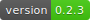
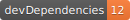

   

# vue-base-blog | Minimal config blog engine

Deploy a fully functional blog made with [VueJS](https://vuejs.org/) + [GitHub Pages](https://guides.github.com/features/pages/)

## ⚙️ Features:

* Posts are compiled from Markdown to html in runtime

* Use [inlined html with bootstrap](/#/features/inline-bootstrap-html) classes within your markdown files

* Support for GitHub Pages CSS and emojis

## 👀 Demo

[https://yeikiu.github.io/vue-base-blog](https://yeikiu.github.io/vue-base-blog)

## 🎬 Quick start

    git clone https://yeikiu.github.io/vue-base-blog
    cd vue-base-blog
    yarn
    yarn serve

### Deploy your own blog

Like what you see?
Read the [full guide](/#/guide/setup-yor-vue-markdown-blog) to deploy your own blog

If you want to use a custom domain but still use GitHub Pages as hosting, read [this help article](https://help.github.com/en/articles/using-a-custom-domain-with-github-pages)

### Credits

Thanks to [@josephharveyangeles](https://github.com/josephharveyangeles/vue-markdown-blog) for his inspiring blog post and repo! :)