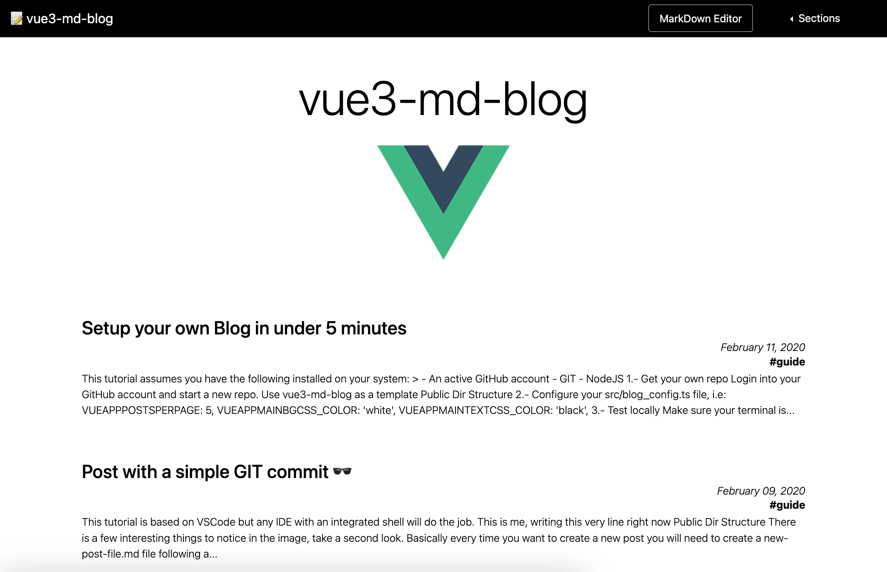

  

# ✍️ Minimal config Vue3 + Markdown blog engine

Deploy a fully functional blog made with [Vue3](https://vuejs.org/) + [GitHub Pages](https://guides.github.com/features/pages/)

## 👀 Demo

[https://yeikiu.github.io/vue3-md-blog](https://yeikiu.github.io/vue3-md-blog)

## ⚙️ Main Features:

* Sync posts with [GitHub Actions](https://docs.github.com/en/actions/getting-started-with-github-actions)

* Posts are compiled from Markdown to html in runtime

* Use [inlined html with bootstrap](https://yeikiu.github.io/vue3-md-blog/#/features/inline-bootstrap-html) classes within your markdown files

* Support for GitHub Pages CSS and emojis

* Dynamic META tags

## 🎬 Quick start

    git clone https://github.com/yeikiu/vue3-md-blog
    cd vue3-md-blog
    npm i
    npm run serve

### Deploy your own blog

Like what you see?
Read the [full guide](https://yeikiu.github.io/vue3-md-blog/#/guide/setup-yor-own-blog) and deploy your own blog in under 5 minutes!

### Next Steps

- [Post and update posts with a simple GIT commit 🕶](https://yeikiu.github.io/vue3-md-blog/#/guide/post-with-a-simple-git-commit)

- Check the [features section](https://yeikiu.github.io/vue3-md-blog/#/features) to see demos of all the cool stuff you can do in your posts!
